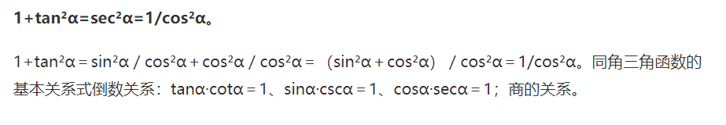

tqdm是一个进度条可视化库，可以帮助我们监测程序运行的进度，估计运行的时长，甚至可以协助debug。

wandb是Weights & Biases的缩写，这款工具能够帮助跟踪你的机器学习项目。
它能够自动记录模型训练过程中的超参数和输出指标，然后可视化和比较结果，并快速与同事共享结果。
通过wandb，能够给你的机器学习项目带来强大的交互式可视化调试体验，能够自动化记录Python脚本中的图标，
并且实时在网页仪表盘展示它的结果，例如，损失函数、准确率、召回率，它能够让你在最短的时间内完成机器学习项目可视化图片的制作。
总结而言，wandb有4项核心功能：
看板：跟踪训练过程，给出可视化结果
报告：保存和共享训练过程中一些细节、有价值的信息
调优：使用超参数调优来优化你训练的模型
工具：数据集和模型版本化
也就是说，wandb并不单纯的是一款数据可视化工具。它具有更为强大的模型和数据版本管理。此外，还可以对你训练的模型进行调优。
Pytorch是一个基于Python的计算包，提供两个高级功能：1、具有强大的GPU加速的张量计算；2、包含自动求导系统的深度神经网络。
CUDA（Compute Unified Device Architecture），是显卡厂商NVIDIA推出的运算平台。在pytorch里代指gpu
它通过利用图形处理器 (GPU) 的处理能力，可大幅提升计算性能。
CUDA™是一种由NVIDIA推出的通用并行计算架构，该架构使GPU能够解决复杂的计算问题。
显存：是用来存储要处理的图形信息的部件，存贮的对像是显卡输出到显示器上的每个像素的信息，显示芯片处理完数据后会将数据保存到显存中。
显存一般有数GB大小，跟内存相似
Tensor：张量

深度学习过程中最多使用5个维度的张量：标量（0维张量），向量（1维度张量），矩阵（2维张量），3维张量，4维张量，5维张量。
常见的三维张量就是图片，例如[224,224,3]。
4维张量最常见的例子就是批图像。例如，加载一批 [64,224,224,3]的图片。

-----------------------------
if __name__ == '__main__'的作用:
一个python文件通常有两种使用方法，第一是作为脚本直接执行，第二是 import 到其他的 python 脚本中被调用（模块重用）执行。
因此 if __name__ == 'main': 的作用就是控制这两种情况执行代码的过程，
在 if __name__ == 'main': 下的代码只有在第一种情况下（即文件作为脚本直接执行）才会被执行，
而 import 到其他脚本中是不会被执行的。
————————————————
torch.cuda.is_available()作用：返回bool值，指示当前CUDA是否可用。
torch.Generator 类来操作随机数
torch.Generator().manual_seed(0) ：使用随机种子生成，不同的随机种子（0、1、2、3....）能够生成不同的随机数。
但只要随机种子一样，每次运行代码都会生成该种子下的随机数。
设置随机种子后，是每次运行test.py文件的输出结果都一样，而不是每次随机函数生成的结果一样.
torch.manual_seed(0)
print(torch.rand(1))#输出0.4963
print(torch.rand(1))#输出0.7682
想让每次都输出一样的随机值，可以在每个随机函数前都设置一模一样的随机种子：
torch.manual_seed(0)
print(torch.rand(1))#输出0.4963
torch.manual_seed(0)
print(torch.rand(1))#输出0.4963

pin_memory就是锁页内存：锁页内存将的Tensor数据转义到GPU的显存就会更快一些
主机中的内存，有两种存在方式，一是锁页，二是不锁页，锁页内存存放的内容在任何情况下都不会与主机的虚拟内存进行交换
（注：虚拟内存就是硬盘），而不锁页内存在主机内存不足时，数据会存放在虚拟内存中。
显卡中的显存全部是锁页内存,当计算机的内存充足的时候，可以设置pin_memory=True。
当系统卡住，或者交换内存使用过多的时候，设置pin_memory=False。
因为pin_memory与电脑硬件性能有关，pytorch开发者不能确保每一个炼丹玩家都有高端设备，因此pin_memory默认为False。
num_worker这个参数会把数据先丢到内存里，可能导致超出内存（或显存？）
torch.from_numpy()方法把数组转换成张量，且二者共享内存，对张量进行修改比如重新赋值，那么原始数组也会相应发生改变。
Numpy创建的数组（ndarray）和Pytorch创建的张量(Tensors)具有相似的形式，但是Tensors具有可以使用GPU计算的优点。

pytorch的Dataloader有一个参数叫做shuffle，设置为True后，每次epoch的时候都会把dataset打乱。
机器学习中，我们会将数据集分成很多个批次来训练。 所有的批次的数据都遍历一遍叫做一个epoch。
shuffle是洗牌的意思，它就是说在一个epoch之后，对所有的数据随机打乱，再按照设定好的每个批次的大小划分批次。
**kwargs 表示关键字参数，它本质上是一个 dict，
>>>def fun(**kwargs):
...     for key, value in kwargs.items():
...         print("{0} 喜欢 {1}".format(key, value))
... 

>>> fun(Geek="cat", cat="box")
Geek 喜欢 cat
cat 喜欢 box
在调用函数时，*（元组）和**（字典）都是分配参数用的
传入多个参数到方法时，f(*元组名)或f(**字典名)；

argparse 模块可以让人轻松编写用户友好的命令行接口。
#1.创建解析器，ArgumentParser 对象包含将命令行解析成 Python 数据类型所需的全部信息
parser = argparse.ArgumentParser(description='Train the UNet on images and target masks')
#2，添加参数，给一个 ArgumentParser 添加程序参数信息是通过调用 add_argument() 方法完成
#3，解析参数，ArgumentParser 通过 parse_args() 方法解析参数

在需要生成随机数据的实验中，每次实验都需要生成数据。设置随机种子是为了确保每次生成固定的随机数，这就使得每次实验结果显示一致了，
有利于实验的比较和改进。使得每次运行该 .py 文件时生成的随机数相同。

 shuffle (bool, optional)：洗牌器：每个纪元重新洗牌数据集
它就是说在一个epoch之后，对所有的数据随机打乱，再按照设定好的每个批次的大小划分批次。
 
同样的代码，同样的输入图像，参数不同（如work_num,batch_size）,训练第一次得到模型的预测结果和第二次不同

训练完成，模型会保存在checkpoints路径下
预测通过终端调用：例如
E:\jiangshan\U-net\Pytorch-UNet>python predict.py -i data/test1.jpg -o ./data/test_output/test1_3output.jpg --viz

加载已有模型训练：
python train.py --load ./checkpoints_SegNet_crack/checkpoint_epoch20.pth
----------------------------------
ctrl + shift + R：搜索代码段、替换代码段
三角函数：
